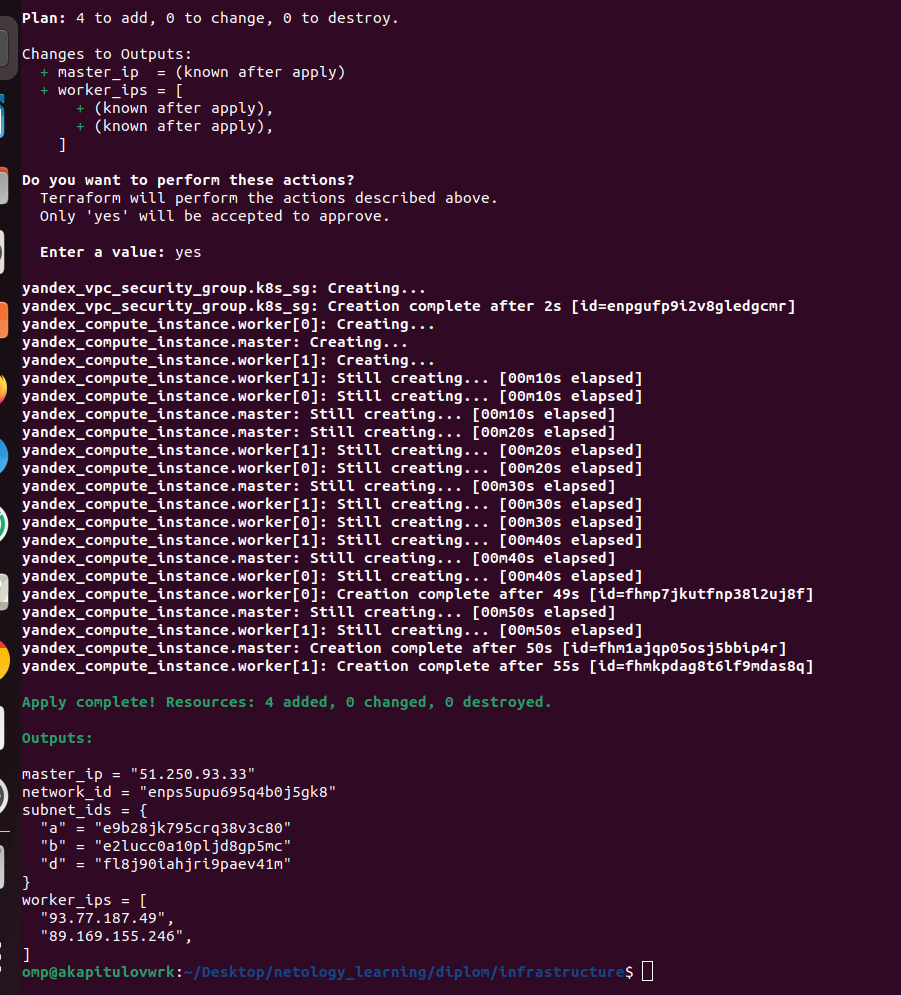
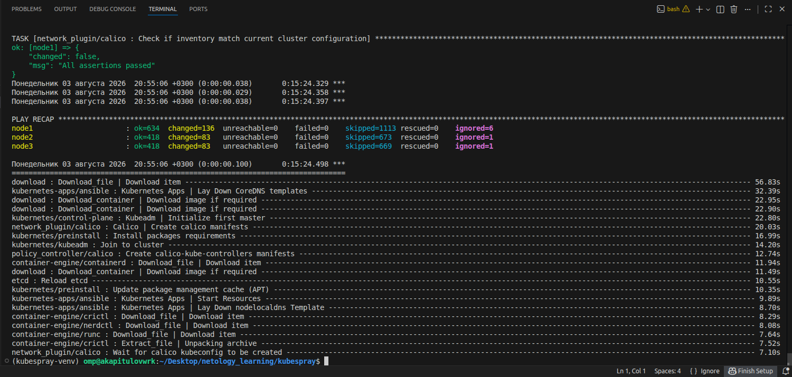
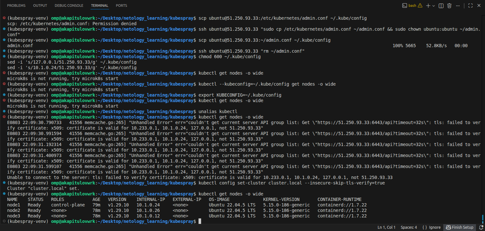
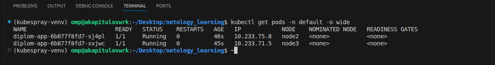
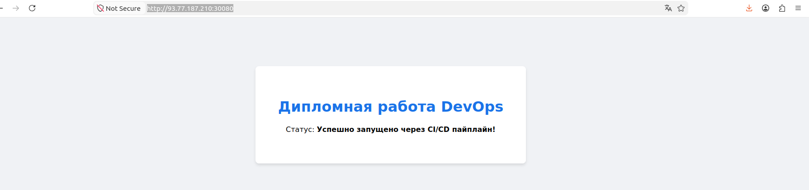
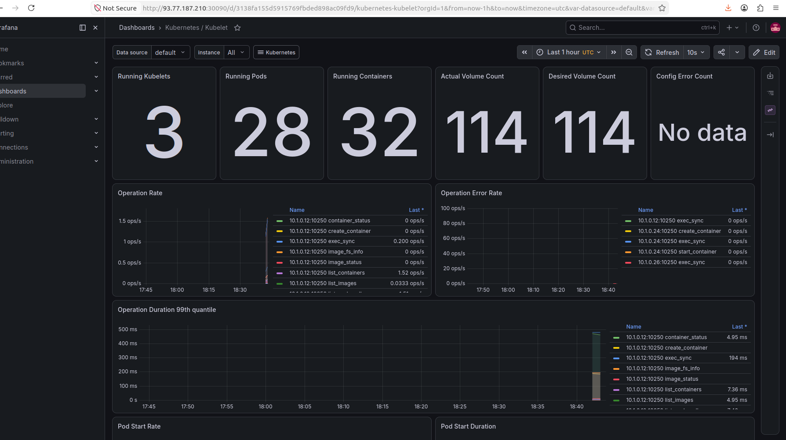

# Дипломный проект «DevOps в Yandex Cloud»

Выполнил: Капитулов А.

## Реализованная архитектура:
1. **Инфраструктура (Terraform)**: Развернута сеть, подсеть и 3 виртуальные машины в Yandex Cloud (1 Master-нода + 2 прерываемых Worker-ноды). Конфигурация находится в папке `infrastructure/`.
2. **Кластер (Kubespray/Ansible)**: Поднят self-hosted Kubernetes кластер версии v1.29.10 с сетевым плагином Calico.
3. **Мониторинг (Helm)**: В пространство имен `monitoring` развернут стек `kube-prometheus-stack`. Интерфейс Grafana доступен по NodePort на порту `30090`.
4. **CI/CD пайплайн (GitHub Actions)**: Настроен автоматический деплой при пуше в ветку `main`. Сценарий собирает Docker-образ, пушит в Docker Hub и обновляет приложение в кластере через `kubectl`.

## Ссылки на ресурсы(ВМ прерываемые):
- Тестовое приложение: http://93.77.187.49:30080
- Дашборд Grafana: http://93.77.187.49:30090

---

## Подтверждение выполнения (Скриншоты)

### 1. Созданные виртуальные машины в Yandex Cloud

### 2. Успешный запуск Kubespray (Ansible Playbook)

### 3. Проверка подключения к кластеру со своего ПК

### 4. Успешный запуск подов тестового приложения и мониторинга

### 5. Вход в приложение и графану

