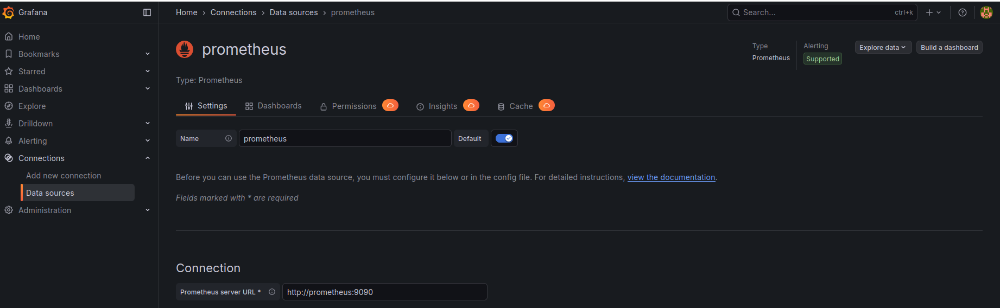
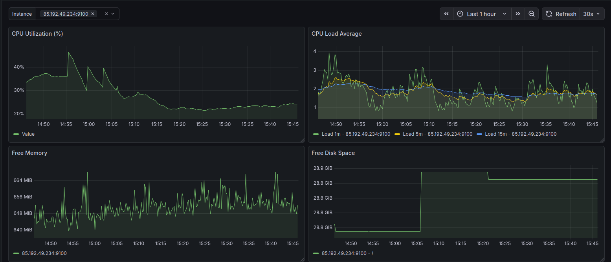
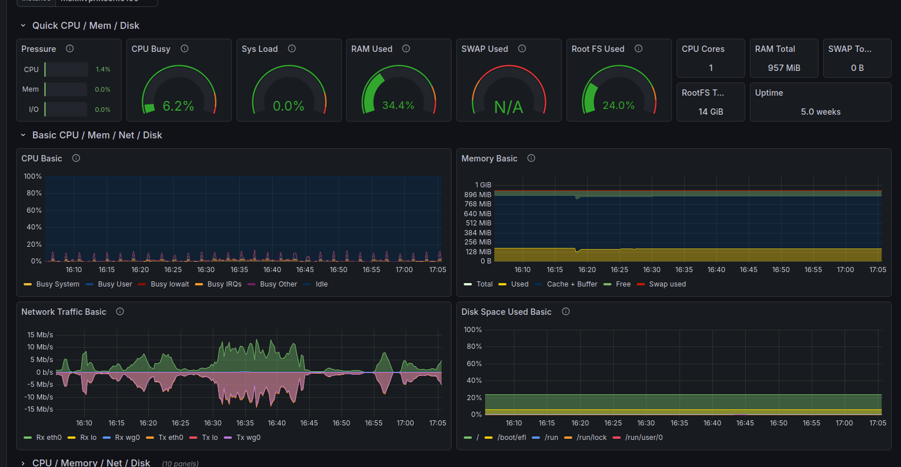

# Домашнее задание к занятию 14 «Средство визуализации Grafana»

## Задание повышенной сложности

**При решении задания 1** не используйте директорию [help](./help) для сборки проекта. Самостоятельно разверните grafana, где в роли источника данных будет выступать prometheus, а сборщиком данных будет node-exporter:

- grafana;
- prometheus-server;
- prometheus node-exporter.

За дополнительными материалами можете обратиться в официальную документацию grafana и prometheus.

В решении к домашнему заданию также приведите все конфигурации, скрипты, манифесты, которые вы 
использовали в процессе решения задания.

**При решении задания 3** вы должны самостоятельно завести удобный для вас канал нотификации, например, Telegram или email, и отправить туда тестовые события.

В решении приведите скриншоты тестовых событий из каналов нотификаций.

## Обязательные задания

### Задание 1

1. Используя директорию [help](./help) внутри этого домашнего задания, запустите связку prometheus-grafana.
2. Зайдите в веб-интерфейс grafana, используя авторизационные данные, указанные в манифесте docker-compose.
3. Подключите поднятый вами prometheus, как источник данных.
4. Решение домашнего задания — скриншот веб-интерфейса grafana со списком подключенных Datasource.
Ответ:



## Задание 2

Изучите самостоятельно ресурсы:

1. [PromQL tutorial for beginners and humans](https://valyala.medium.com/promql-tutorial-for-beginners-9ab455142085).
2. [Understanding Machine CPU usage](https://www.robustperception.io/understanding-machine-cpu-usage).
3. [Introduction to PromQL, the Prometheus query language](https://grafana.com/blog/2020/02/04/introduction-to-promql-the-prometheus-query-language/).

Создайте Dashboard и в ней создайте Panels:

# - утилизация CPU для nodeexporter (в процентах, 100-idle);

## Ответ:
### 100 - (avg by ("$instance") (rate(node_cpu_seconds_total{mode="idle"}[5m])) * 100)

# - CPULA 1/5/15;

## Ответ:
### node_load1{instance=~"$instance"}
### node_load5{instance=~"$instance"}
### node_load15{instance=~"$instance"}

# - количество свободной оперативной памяти;
## Ответ:
### node_memory_MemAvailable_bytes{instance=~"$instance"}

# - количество места на файловой системе.
## Ответ:
### node_filesystem_avail_bytes{instance=~"$instance", fstype!~"tmpfs|overlay|squashfs", mountpoint="/"}

 Для решения этого задания приведите promql-запросы для выдачи этих метрик, а также скриншот получившейся Dashboard.


## Задание 3

1. Создайте для каждой Dashboard подходящее правило alert — можно обратиться к первой лекции в блоке «Мониторинг».
1. В качестве решения задания приведите скриншот вашей итоговой Dashboard.
##
Взял за основу node exported dashboard

## Задание 4

1. Сохраните ваш Dashboard.Для этого перейдите в настройки Dashboard, выберите в боковом меню «JSON MODEL». Далее скопируйте отображаемое json-содержимое в отдельный файл и сохраните его.
1. В качестве решения задания приведите листинг этого файла.
<details>
<summary><strong>JSON Configuration for Grafana Alerts</strong></summary>

```json
{
  "apiVersion": 1,
  "groups": [
    {
      "orgId": 1,
      "name": "VPN-Node-Alerts-CPU",
      "folder": "VPN",
      "interval": "30s",
      "rules": [
        {
          "uid": "high-cpu-usage-vpn",
          "title": "High CPU Usage on VPN Node",
          "condition": "B",
          "data": [
            {
              "refId": "A",
              "relativeTimeRange": {
                "from": 600,
                "to": 0
              },
              "datasourceUid": "afa3donixdgxsd",
              "model": {
                "editorMode": "code",
                "expr": "100 * (1 - avg by (instance) (rate(node_cpu_seconds_total{mode=\"idle\", job=\"node\"}[5m])))",
                "instant": true,
                "intervalMs": 1000,
                "legendFormat": "{{instance}}",
                "maxDataPoints": 43200,
                "range": false,
                "refId": "A"
              }
            },
            {
              "refId": "B",
              "relativeTimeRange": {
                "from": 0,
                "to": 0
              },
              "datasourceUid": "__expr__",
              "model": {
                "conditions": [
                  {
                    "evaluator": {
                      "params": [
                        90
                      ],
                      "type": "gt"
                    },
                    "operator": {
                      "type": "and"
                    },
                    "query": {
                      "params": [
                        "A"
                      ]
                    },
                    "reducer": {
                      "params": [],
                      "type": "last"
                    },
                    "type": "query"
                  }
                ],
                "datasource": {
                  "type": "__expr__",
                  "uid": "__expr__"
                },
                "expression": "A",
                "intervalMs": 1000,
                "maxDataPoints": 43200,
                "refId": "B",
                "type": "threshold"
              }
            }
          ],
          "dashboardUid": "",
          "panelId": 0,
          "noDataState": "Alerting",
          "execErrState": "Alerting",
          "for": "5m",
          "annotations": {
            "description": "Загрузка CPU превышает 90% в течение 5 минут. Текущее значение: {{ $value | printf \"%.2f\" }}%\nНода: {{ $labels.instance }}",
            "summary": "🔥 Высокая загрузка CPU на {{ $labels.instance }}"
          },
          "labels": {
            "service": "vpn-node",
            "severity": "warning",
            "team": "infrastructure"
          },
          "isPaused": false,
          "notification_settings": {
            "receiver": "Telega"
          }
        },
        {
          "uid": "critical-cpu-usage-vpn",
          "title": "Critical CPU Usage on VPN Node",
          "condition": "B",
          "data": [
            {
              "refId": "A",
              "relativeTimeRange": {
                "from": 600,
                "to": 0
              },
              "datasourceUid": "afa3donixdgxsd",
              "model": {
                "editorMode": "code",
                "expr": "100 * (1 - avg by (instance) (rate(node_cpu_seconds_total{mode=\"idle\", job=\"node\"}[2m])))",
                "instant": true,
                "intervalMs": 1000,
                "legendFormat": "{{instance}}",
                "maxDataPoints": 43200,
                "range": false,
                "refId": "A"
              }
            },
            {
              "refId": "B",
              "relativeTimeRange": {
                "from": 0,
                "to": 0
              },
              "datasourceUid": "__expr__",
              "model": {
                "conditions": [
                  {
                    "evaluator": {
                      "params": [
                        95
                      ],
                      "type": "gt"
                    },
                    "operator": {
                      "type": "and"
                    },
                    "query": {
                      "params": [
                        "A"
                      ]
                    },
                    "reducer": {
                      "params": [],
                      "type": "last"
                    },
                    "type": "query"
                  }
                ],
                "datasource": {
                  "type": "__expr__",
                  "uid": "__expr__"
                },
                "expression": "A",
                "intervalMs": 1000,
                "maxDataPoints": 43200,
                "refId": "B",
                "type": "threshold"
              }
            }
          ],
          "dashboardUid": "",
          "panelId": 0,
          "noDataState": "Alerting",
          "execErrState": "Alerting",
          "for": "2m",
          "annotations": {
            "description": "Загрузка CPU превышает 95%! Возможна деградация сервиса.\nТекущее значение: {{ $value | printf \"%.2f\" }}%\nНемедленно проверьте нагрузку на туннели и процессы.",
            "summary": "🚨 Критическая загрузка CPU на {{ $labels.instance }}"
          },
          "labels": {
            "service": "vpn-node",
            "severity": "critical",
            "team": "infrastructure"
          },
          "isPaused": false,
          "notification_settings": {
            "receiver": "Telega"
          }
        }
      ]
    },
    {
      "orgId": 1,
      "name": "VPN-Node-Alerts-Disk",
      "folder": "VPN",
      "interval": "30s",
      "rules": [
        {
          "uid": "low-disk-space-root-vpn",
          "title": "Low Disk Space Root on VPN Node",
          "condition": "B",
          "data": [
            {
              "refId": "A",
              "relativeTimeRange": {
                "from": 600,
                "to": 0
              },
              "datasourceUid": "afa3donixdgxsd",
              "model": {
                "editorMode": "code",
                "expr": "( ( node_filesystem_size_bytes{mountpoint=\"/\", fstype!=\"rootfs\", job=\"node\"} - node_filesystem_avail_bytes{mountpoint=\"/\", fstype!=\"rootfs\", job=\"node\"} ) / node_filesystem_size_bytes{mountpoint=\"/\", fstype!=\"rootfs\", job=\"node\"} ) * 100",
                "instant": true,
                "intervalMs": 1000,
                "legendFormat": "{{instance}}",
                "maxDataPoints": 43200,
                "range": false,
                "refId": "A"
              }
            },
            {
              "refId": "B",
              "relativeTimeRange": {
                "from": 0,
                "to": 0
              },
              "datasourceUid": "__expr__",
              "model": {
                "conditions": [
                  {
                    "evaluator": {
                      "params": [
                        85
                      ],
                      "type": "gt"
                    },
                    "operator": {
                      "type": "and"
                    },
                    "query": {
                      "params": [
                        "A"
                      ]
                    },
                    "reducer": {
                      "params": [],
                      "type": "last"
                    },
                    "type": "query"
                  }
                ],
                "datasource": {
                  "type": "__expr__",
                  "uid": "__expr__"
                },
                "expression": "A",
                "intervalMs": 1000,
                "maxDataPoints": 43200,
                "refId": "B",
                "type": "threshold"
              }
            }
          ],
          "dashboardUid": "",
          "panelId": 0,
          "noDataState": "Alerting",
          "execErrState": "Alerting",
          "for": "10m",
          "annotations": {
            "description": "Использовано более 85% корневого раздела.\nЗанято: {{ $value | printf \"%.2f\" }}%\nПроверьте логи и очистите старые файлы.",
            "summary": "💿 Мало места на / на {{ $labels.instance }}"
          },
          "labels": {
            "service": "vpn-node",
            "severity": "warning",
            "team": "infrastructure"
          },
          "isPaused": false,
          "notification_settings": {
            "receiver": "Telega"
          }
        },
        {
          "uid": "critical-low-disk-space-root-vpn",
          "title": "Critical Low Disk Space Root on VPN Node",
          "condition": "B",
          "data": [
            {
              "refId": "A",
              "relativeTimeRange": {
                "from": 600,
                "to": 0
              },
              "datasourceUid": "afa3donixdgxsd",
              "model": {
                "editorMode": "code",
                "expr": "( ( node_filesystem_size_bytes{mountpoint=\"/\", fstype!=\"rootfs\", job=\"node\"} - node_filesystem_avail_bytes{mountpoint=\"/\", fstype!=\"rootfs\", job=\"node\"} ) / node_filesystem_size_bytes{mountpoint=\"/\", fstype!=\"rootfs\", job=\"node\"} ) * 100",
                "instant": true,
                "intervalMs": 1000,
                "legendFormat": "{{instance}}",
                "maxDataPoints": 43200,
                "range": false,
                "refId": "A"
              }
            },
            {
              "refId": "B",
              "relativeTimeRange": {
                "from": 0,
                "to": 0
              },
              "datasourceUid": "__expr__",
              "model": {
                "conditions": [
                  {
                    "evaluator": {
                      "params": [
                        95
                      ],
                      "type": "gt"
                    },
                    "operator": {
                      "type": "and"
                    },
                    "query": {
                      "params": [
                        "A"
                      ]
                    },
                    "reducer": {
                      "params": [],
                      "type": "last"
                    },
                    "type": "query"
                  }
                ],
                "datasource": {
                  "type": "__expr__",
                  "uid": "__expr__"
                },
                "expression": "A",
                "intervalMs": 1000,
                "maxDataPoints": 43200,
                "refId": "B",
                "type": "threshold"
              }
            }
          ],
          "dashboardUid": "",
          "panelId": 0,
          "noDataState": "Alerting",
          "execErrState": "Alerting",
          "for": "5m",
          "annotations": {
            "description": "Использовано более 95% корневого раздела!\nНемедленно освободите место. Нода может упасть.",
            "summary": "🚨 Критически мало места на / на {{ $labels.instance }}"
          },
          "labels": {
            "service": "vpn-node",
            "severity": "critical",
            "team": "infrastructure"
          },
          "isPaused": false,
          "notification_settings": {
            "receiver": "Telega"
          }
        }
      ]
    },
    {
      "orgId": 1,
      "name": "VPN-Node-Alerts-Memory",
      "folder": "VPN",
      "interval": "30s",
      "rules": [
        {
          "uid": "low-memory-available-vpn",
          "title": "Low Memory Available on VPN Node",
          "condition": "B",
          "data": [
            {
              "refId": "A",
              "relativeTimeRange": {
                "from": 600,
                "to": 0
              },
              "datasourceUid": "afa3donixdgxsd",
              "model": {
                "editorMode": "code",
                "expr": "(node_memory_MemAvailable_bytes{job=\"node\"} / node_memory_MemTotal_bytes{job=\"node\"}) * 100",
                "instant": true,
                "intervalMs": 1000,
                "legendFormat": "{{instance}}",
                "maxDataPoints": 43200,
                "range": false,
                "refId": "A"
              }
            },
            {
              "refId": "B",
              "relativeTimeRange": {
                "from": 0,
                "to": 0
              },
              "datasourceUid": "__expr__",
              "model": {
                "conditions": [
                  {
                    "evaluator": {
                      "params": [
                        10
                      ],
                      "type": "lt"
                    },
                    "operator": {
                      "type": "and"
                    },
                    "query": {
                      "params": [
                        "A"
                      ]
                    },
                    "reducer": {
                      "params": [],
                      "type": "last"
                    },
                    "type": "query"
                  }
                ],
                "datasource": {
                  "type": "__expr__",
                  "uid": "__expr__"
                },
                "expression": "A",
                "intervalMs": 1000,
                "maxDataPoints": 43200,
                "refId": "B",
                "type": "threshold"
              }
            }
          ],
          "dashboardUid": "",
          "panelId": 0,
          "noDataState": "Alerting",
          "execErrState": "Alerting",
          "for": "5m",
          "annotations": {
            "description": "Доступно менее 10% оперативной памяти.\nСвободно: {{ $value | printf \"%.2f\" }}%\nПроверьте процессы, связанные с VPN.",
            "summary": "💾 Мало свободной памяти на {{ $labels.instance }}"
          },
          "labels": {
            "service": "vpn-node",
            "severity": "warning",
            "team": "infrastructure"
          },
          "isPaused": false,
          "notification_settings": {
            "receiver": "Telega"
          }
        },
        {
          "uid": "critical-low-memory-vpn",
          "title": "Critical Low Memory on VPN Node",
          "condition": "B",
          "data": [
            {
              "refId": "A",
              "relativeTimeRange": {
                "from": 600,
                "to": 0
              },
              "datasourceUid": "afa3donixdgxsd",
              "model": {
                "editorMode": "code",
                "expr": "(node_memory_MemAvailable_bytes{job=\"node\"} / node_memory_MemTotal_bytes{job=\"node\"}) * 100",
                "instant": true,
                "intervalMs": 1000,
                "legendFormat": "{{instance}}",
                "maxDataPoints": 43200,
                "range": false,
                "refId": "A"
              }
            },
            {
              "refId": "B",
              "relativeTimeRange": {
                "from": 0,
                "to": 0
              },
              "datasourceUid": "__expr__",
              "model": {
                "conditions": [
                  {
                    "evaluator": {
                      "params": [
                        5
                      ],
                      "type": "lt"
                    },
                    "operator": {
                      "type": "and"
                    },
                    "query": {
                      "params": [
                        "A"
                      ]
                    },
                    "reducer": {
                      "params": [],
                      "type": "last"
                    },
                    "type": "query"
                  }
                ],
                "datasource": {
                  "type": "__expr__",
                  "uid": "__expr__"
                },
                "expression": "A",
                "intervalMs": 1000,
                "maxDataPoints": 43200,
                "refId": "B",
                "type": "threshold"
              }
            }
          ],
          "dashboardUid": "",
          "panelId": 0,
          "noDataState": "Alerting",
          "execErrState": "Alerting",
          "for": "2m",
          "annotations": {
            "description": "Доступно менее 5% памяти! Риск OOM-killer.\nСвободно: {{ $value | printf \"%.2f\" }}%\nНемедленно освободите память или перезапустите ноду.",
            "summary": "🚨 Критически мало памяти на {{ $labels.instance }}"
          },
          "labels": {
            "service": "vpn-node",
            "severity": "critical",
            "team": "infrastructure"
          },
          "isPaused": false,
          "notification_settings": {
            "receiver": "Telega"
          }
        }
      ]
    },
    {
      "orgId": 1,
      "name": "VPN-Node-Alerts-Network",
      "folder": "VPN",
      "interval": "30s",
      "rules": [
        {
          "uid": "network-interface-down-vpn",
          "title": "Network Interface Down on VPN Node",
          "condition": "B",
          "data": [
            {
              "refId": "A",
              "relativeTimeRange": {
                "from": 600,
                "to": 0
              },
              "datasourceUid": "afa3donixdgxsd",
              "model": {
                "editorMode": "code",
                "expr": "node_network_up{device!=\"lo\", job=\"node\"}",
                "instant": true,
                "intervalMs": 1000,
                "legendFormat": "{{instance}} - {{device}}",
                "maxDataPoints": 43200,
                "range": false,
                "refId": "A"
              }
            },
            {
              "refId": "B",
              "relativeTimeRange": {
                "from": 0,
                "to": 0
              },
              "datasourceUid": "__expr__",
              "model": {
                "conditions": [
                  {
                    "evaluator": {
                      "params": [
                        0
                      ],
                      "type": "eq"
                    },
                    "operator": {
                      "type": "and"
                    },
                    "query": {
                      "params": [
                        "A"
                      ]
                    },
                    "reducer": {
                      "params": [],
                      "type": "last"
                    },
                    "type": "query"
                  }
                ],
                "datasource": {
                  "type": "__expr__",
                  "uid": "__expr__"
                },
                "expression": "A",
                "intervalMs": 1000,
                "maxDataPoints": 43200,
                "refId": "B",
                "type": "threshold"
              }
            }
          ],
          "dashboardUid": "",
          "panelId": 0,
          "noDataState": "Alerting",
          "execErrState": "Alerting",
          "for": "2m",
          "annotations": {
            "description": "Сетевой интерфейс {{ $labels.device }} перешёл в состояние DOWN.\nПроверьте подключение к VPN и физическую сеть.",
            "summary": "🔌 Интерфейс {{ $labels.device }} неактивен на {{ $labels.instance }}"
          },
          "labels": {
            "service": "vpn-node",
            "severity": "critical",
            "team": "infrastructure"
          },
          "isPaused": false,
          "notification_settings": {
            "receiver": "Telega"
          }
        },
        {
          "uid": "vpn-interface-traffic-stalled-vpn",
          "title": "VPN Interface Traffic Stalled",
          "condition": "B",
          "data": [
            {
              "refId": "A",
              "relativeTimeRange": {
                "from": 600,
                "to": 0
              },
              "datasourceUid": "afa3donixdgxsd",
              "model": {
                "editorMode": "code",
                "expr": "( ( rate(node_network_receive_bytes_total{device=~\"tun.*|wg.*|vpn.*|ppp.*|openvpn.*\", job=\"node\"}[10m]) == 0 and rate(node_network_transmit_bytes_total{device=~\"tun.*|wg.*|vpn.*|ppp.*|openvpn.*\", job=\"node\"}[10m]) == 0 ) and node_network_up{device=~\"tun.*|wg.*|vpn.*|ppp.*|openvpn.*\", job=\"node\"} == 1 )",
                "instant": true,
                "intervalMs": 1000,
                "legendFormat": "{{instance}} - {{device}}",
                "maxDataPoints": 43200,
                "range": false,
                "refId": "A"
              }
            },
            {
              "refId": "B",
              "relativeTimeRange": {
                "from": 0,
                "to": 0
              },
              "datasourceUid": "__expr__",
              "model": {
                "conditions": [
                  {
                    "evaluator": {
                      "params": [
                        0
                      ],
                      "type": "gt"
                    },
                    "operator": {
                      "type": "and"
                    },
                    "query": {
                      "params": [
                        "A"
                      ]
                    },
                    "reducer": {
                      "params": [],
                      "type": "last"
                    },
                    "type": "query"
                  }
                ],
                "datasource": {
                  "type": "__expr__",
                  "uid": "__expr__"
                },
                "expression": "A",
                "intervalMs": 1000,
                "maxDataPoints": 43200,
                "refId": "B",
                "type": "threshold"
              }
            }
          ],
          "dashboardUid": "",
          "panelId": 0,
          "noDataState": "Alerting",
          "execErrState": "Alerting",
          "for": "10m",
          "annotations": {
            "description": "VPN-интерфейс {{ $labels.device }} активен, но трафик отсутствует 10 минут.\nПроверьте состояние туннеля и подключения клиентов.",
            "summary": "🔐 VPN-трафик остановился на {{ $labels.instance }}"
          },
          "labels": {
            "service": "vpn-node",
            "severity": "critical",
            "team": "infrastructure"
          },
          "isPaused": false,
          "notification_settings": {
            "receiver": "Telega"
          }
        },
        {
          "uid": "high-network-errors-vpn",
          "title": "High Network Errors on VPN Node",
          "condition": "B",
          "data": [
            {
              "refId": "A",
              "relativeTimeRange": {
                "from": 600,
                "to": 0
              },
              "datasourceUid": "afa3donixdgxsd",
              "model": {
                "editorMode": "code",
                "expr": "rate(node_network_receive_errs_total{job=\"node\"}[5m]) > 10 or rate(node_network_transmit_errs_total{job=\"node\"}[5m]) > 10",
                "instant": true,
                "intervalMs": 1000,
                "legendFormat": "{{instance}} - {{device}}",
                "maxDataPoints": 43200,
                "range": false,
                "refId": "A"
              }
            },
            {
              "refId": "B",
              "relativeTimeRange": {
                "from": 0,
                "to": 0
              },
              "datasourceUid": "__expr__",
              "model": {
                "conditions": [
                  {
                    "evaluator": {
                      "params": [
                        0
                      ],
                      "type": "gt"
                    },
                    "operator": {
                      "type": "and"
                    },
                    "query": {
                      "params": [
                        "A"
                      ]
                    },
                    "reducer": {
                      "params": [],
                      "type": "last"
                    },
                    "type": "query"
                  }
                ],
                "datasource": {
                  "type": "__expr__",
                  "uid": "__expr__"
                },
                "expression": "A",
                "intervalMs": 1000,
                "maxDataPoints": 43200,
                "refId": "B",
                "type": "threshold"
              }
            }
          ],
          "dashboardUid": "",
          "panelId": 0,
          "noDataState": "Alerting",
          "execErrState": "Alerting",
          "for": "5m",
          "annotations": {
            "description": "Высокий уровень ошибок:\nRx/Tx errors: {{ $value | printf \"%.2f\" }}/сек\nВозможно, проблема с кабелем, драйвером или VPN-туннелем.",
            "summary": "📡 Ошибки сети на интерфейсе {{ $labels.device }} ({{ $labels.instance }})"
          },
          "labels": {
            "service": "vpn-node",
            "severity": "warning",
            "team": "infrastructure"
          },
          "isPaused": false,
          "notification_settings": {
            "receiver": "Telega"
          }
        }
      ]
    },
    {
      "orgId": 1,
      "name": "VPN-Node-Alerts-System",
      "folder": "VPN",
      "interval": "30s",
      "rules": [
        {
          "uid": "node-exporter-down-vpn",
          "title": "Node Exporter Down on VPN Node",
          "condition": "B",
          "data": [
            {
              "refId": "A",
              "relativeTimeRange": {
                "from": 600,
                "to": 0
              },
              "datasourceUid": "afa3donixdgxsd",
              "model": {
                "editorMode": "code",
                "expr": "up{job=\"node\"}",
                "instant": true,
                "intervalMs": 1000,
                "legendFormat": "{{instance}}",
                "maxDataPoints": 43200,
                "range": false,
                "refId": "A"
              }
            },
            {
              "refId": "B",
              "relativeTimeRange": {
                "from": 0,
                "to": 0
              },
              "datasourceUid": "__expr__",
              "model": {
                "conditions": [
                  {
                    "evaluator": {
                      "params": [
                        0
                      ],
                      "type": "eq"
                    },
                    "operator": {
                      "type": "and"
                    },
                    "query": {
                      "params": [
                        "A"
                      ]
                    },
                    "reducer": {
                      "params": [],
                      "type": "last"
                    },
                    "type": "query"
                  }
                ],
                "datasource": {
                  "type": "__expr__",
                  "uid": "__expr__"
                },
                "expression": "A",
                "intervalMs": 1000,
                "maxDataPoints": 43200,
                "refId": "B",
                "type": "threshold"
              }
            }
          ],
          "dashboardUid": "",
          "panelId": 0,
          "noDataState": "Alerting",
          "execErrState": "Alerting",
          "for": "2m",
          "annotations": {
            "description": "Prometheus не может собрать метрики с ноды более 2 минут.\nПроверьте доступность ноды и службу node_exporter.",
            "summary": "🔴 Node Exporter не отвечает на {{ $labels.instance }}"
          },
          "labels": {
            "service": "vpn-node",
            "severity": "critical",
            "team": "infrastructure"
          },
          "isPaused": false,
          "notification_settings": {
            "receiver": "Telega"
          }
        },
        {
          "uid": "filesystem-read-only-vpn",
          "title": "Filesystem Read Only on VPN Node",
          "condition": "B",
          "data": [
            {
              "refId": "A",
              "relativeTimeRange": {
                "from": 600,
                "to": 0
              },
              "datasourceUid": "afa3donixdgxsd",
              "model": {
                "editorMode": "code",
                "expr": "node_filesystem_readonly{fstype!=\"rootfs\", job=\"node\"}",
                "instant": true,
                "intervalMs": 1000,
                "legendFormat": "{{instance}} - {{mountpoint}}",
                "maxDataPoints": 43200,
                "range": false,
                "refId": "A"
              }
            },
            {
              "refId": "B",
              "relativeTimeRange": {
                "from": 0,
                "to": 0
              },
              "datasourceUid": "__expr__",
              "model": {
                "conditions": [
                  {
                    "evaluator": {
                      "params": [
                        1
                      ],
                      "type": "eq"
                    },
                    "operator": {
                      "type": "and"
                    },
                    "query": {
                      "params": [
                        "A"
                      ]
                    },
                    "reducer": {
                      "params": [],
                      "type": "last"
                    },
                    "type": "query"
                  }
                ],
                "datasource": {
                  "type": "__expr__",
                  "uid": "__expr__"
                },
                "expression": "A",
                "intervalMs": 1000,
                "maxDataPoints": 43200,
                "refId": "B",
                "type": "threshold"
              }
            }
          ],
          "dashboardUid": "",
          "panelId": 0,
          "noDataState": "Alerting",
          "execErrState": "Alerting",
          "for": "1m",
          "annotations": {
            "description": "Монтирование {{ $labels.mountpoint }} перешло в read-only.\nВозможна ошибка диска или ФС. Проверьте SMART-статус.",
            "summary": "🔒 Файловая система в режиме read-only на {{ $labels.instance }}"
          },
          "labels": {
            "service": "vpn-node",
            "severity": "critical",
            "team": "infrastructure"
          },
          "isPaused": false,
          "notification_settings": {
            "receiver": "Telega"
          }
        }
      ]
    }
  ]
}
---

### Как оформить решение задания

Выполненное домашнее задание пришлите в виде ссылки на .md-файл в вашем репозитории.

---
